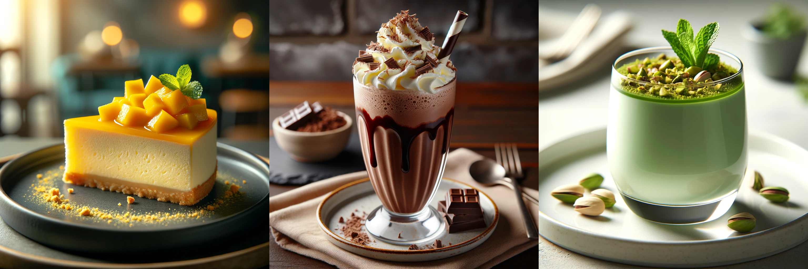

# MangoCrisp Labs ~ AI x Gastronomy

This an experimental wing of [MangoCrisp](https://mangocrisp.com), a culinary genie in a bottle, giving you the ability to create unique and breathtaking dishes.

## Stable Diffusion

For stable diffusion experiments, check out my Notebooks in the [stable-diffusion](https://github.com/Nikhil22/mangocrisp-labs/tree/main/stable-diffusion) folder.

## Effective Training

For effective training experiments, check out my Notebooks in the [training](https://github.com/Nikhil22/mangocrisp-labs/tree/main/training) folder. This makes use of the [gym](https://github.com/Nikhil22/mangocrisp-labs/tree/main/gym) module.

